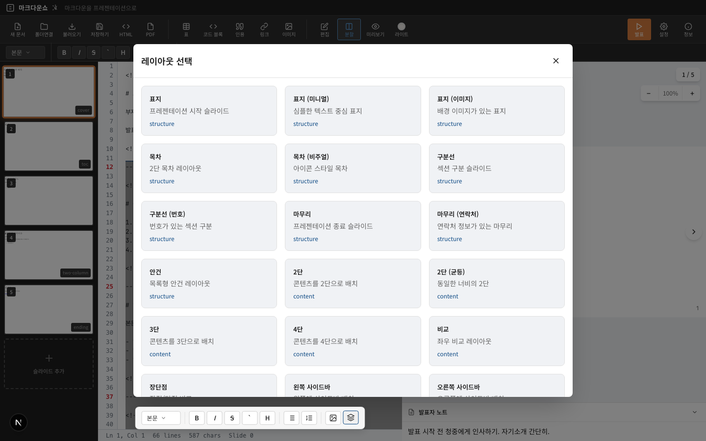

# 마크다운쇼(Marp Editor) 기획

> 브라우저에서 마크다운으로 프레젠테이션을 만드는 웹 에디터

## 프로젝트 배경

파워포인트나 키노트 없이 **마크다운만으로 프레젠테이션을 만들 수 없을까?**

기존 Marp CLI는 로컬에서 마크다운 파일을 변환하는 방식이지만, 설치와 실행의 번거로움이 있었습니다. 웹에서 바로 편집하고 미리보기하며 내보내기까지 한 번에 할 수 있는 도구가 필요했습니다.

## 핵심 요구사항

### 1. 실시간 미리보기

마크다운을 작성하면 **즉시** 슬라이드 형태로 렌더링됩니다. WYSIWYG에 가까운 경험을 제공하면서도 마크다운의 생산성을 유지합니다.


### 2. 슬라이드 탐색 (필름스트립)

왼쪽 사이드바에서 전체 슬라이드를 썸네일로 확인하고 빠르게 이동할 수 있습니다. 파워포인트의 슬라이드 패널과 유사한 UX입니다.


### 3. 레이아웃 프리셋

처음부터 작성하기 어려운 사용자를 위해 **62가지 레이아웃 프리셋**을 제공합니다.

- **구조**: 표지, 목차, 구분선, 엔딩
- **콘텐츠**: 2단/3단 레이아웃, 비교, 코드 중심
- **비주얼**: 이미지 배치, 갤러리, 카드
- **특수**: 인용구, 타임라인, 통계, 하이라이트
- **비즈니스**: SWOT, 매트릭스, 프로세스, 로드맵
- **데이터**: 차트, KPI, 테이블, 퍼널



### 4. 내보내기

- **PDF**: 브라우저 인쇄 기능을 활용한 고품질 PDF 출력
- **PPTX**: 네이티브 텍스트로 변환하여 PowerPoint에서 편집 가능
- **HTML**: 독립 실행 가능한 HTML 파일

## 기술 스택 선정

| 영역 | 선택 | 이유 |
|------|------|------|
| 프레임워크 | Next.js 15 (App Router) | RSC, 이미지 최적화, Vercel 통합 |
| 에디터 | CodeMirror 6 | 확장성, 성능, 마크다운 지원 |
| 슬라이드 렌더링 | Marp Core | 표준 마크다운 → 슬라이드 변환 |
| 스타일링 | CSS Variables + styled-jsx | 테마 시스템, 컴포넌트 스코프 |
| 배포 | Vercel | 서버리스, Edge Functions |

## UI/UX 설계 원칙

### PowerPoint 스타일 다크 테마

파워포인트 사용자에게 익숙한 다크 테마를 기본으로 채택했습니다.

```css
--mp-bg: #1f1f1f;        /* 배경 */
--mp-chrome: #2d2d2d;    /* 크롬 영역 */
--mp-accent: #5a9bd5;    /* 액센트 (파란색) */
--mp-coral: #d67d3e;     /* 포인트 (오렌지) */
--mp-text: #c8c8c8;      /* 텍스트 */
```

### 플로팅 포맷 바

에디터 하단에 떠 있는 포맷 바로 빠른 서식 적용이 가능합니다.

- Bold, Italic, Strikethrough
- 제목 레벨 (H1~H6)
- 리스트 (순서/비순서)
- 이미지 삽입
- 레이아웃 프리셋

## 다음 단계

기획이 완료되면 [[02-development|개발]] 단계로 넘어갑니다. 실제 코드 구현과 아키텍처에 대해 다룹니다.

---

**시리즈 목차**
1. **기획** (현재 글)
2. [[02-development|개발]]
3. [[03-deployment|배포]]
