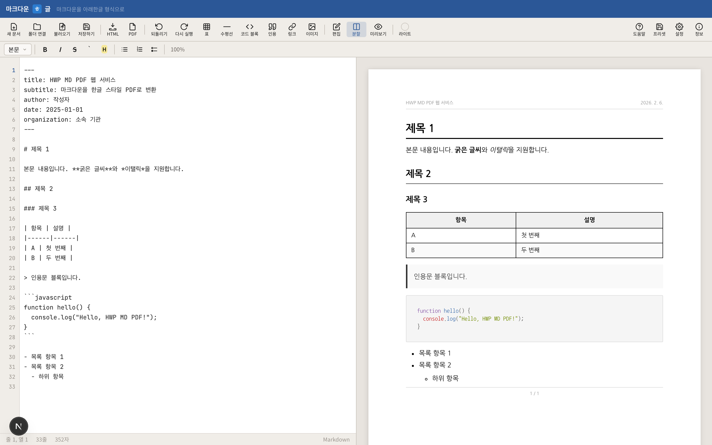

# 마크다운ㅎ글 개발기 (1) - 기획: 마크다운으로 공문서 쓰기

> "왜 개발자는 공문서 쓸 때마다 고통받아야 할까?"

## 문제 정의: 아래한글과 마크다운 사이의 간극

### 아래한글의 불편함

한국의 공공기관, 기업, 학계에서는 여전히 **아래한글(HWP)** 형식의 문서를 표준으로 요구합니다. 그러나 아래한글은 개발자 관점에서 여러 문제점이 있습니다.

1. **Windows 종속성**: macOS나 Linux 사용자는 별도 뷰어를 설치하거나 가상머신을 써야 합니다.
2. **유료 소프트웨어**: 정식 버전을 사용하려면 라이선스를 구매해야 합니다.
3. **버전 관리 불가**: 바이너리 파일이라 Git으로 diff를 볼 수 없고, 협업이 어렵습니다.
4. **자동화 어려움**: 스크립트로 생성하거나 CI/CD 파이프라인에 넣기 힘듭니다.
5. **복잡한 UI**: 개발자에게 익숙하지 않은 워드프로세서 인터페이스입니다.

### 마크다운의 한계

반면 개발자들은 **마크다운(Markdown)**을 사랑합니다. 간결하고, 버전 관리가 쉽고, 텍스트 에디터만 있으면 어디서든 작성할 수 있으니까요.

하지만 마크다운으로 생성한 문서는 대부분 **"캐주얼"**해 보입니다. GitHub이나 기술 블로그에는 적합하지만, 한국의 공식 문서로 제출하기엔 형식이 부족합니다.

- 표지(cover page)가 없습니다.
- 목차(TOC)가 자동으로 생성되지 않습니다.
- 제목 번호 매기기(1.1, 1.2.1...)가 없습니다.
- 한글 폰트가 제대로 렌더링되지 않습니다.
- A4 용지 기준 페이지 구분이 없습니다.

### 핵심 문제

**"개발자가 마크다운으로 문서를 쓰되, 아래한글 스타일의 공식 문서로 출력할 수는 없을까?"**

이 질문이 **마크다운ㅎ글(markdown-hangul)** 프로젝트의 시작점이었습니다.

---

## 아이디어: 마크다운 입력 → HWP 스타일 PDF 출력

### 핵심 컨셉

마크다운ㅎ글의 아이디어는 간단합니다.

```
마크다운 작성 → 실시간 A4 미리보기 → 공식 문서 스타일 PDF 다운로드
```

1. **입력은 마크다운**: 개발자가 익숙한 문법 그대로 작성합니다.
2. **출력은 공문서**: 표지, 목차, 번호 매기기, 한글 폰트가 적용된 PDF를 생성합니다.
3. **실시간 미리보기**: 타이핑하면 즉시 A4 용지 기준으로 렌더링된 결과를 볼 수 있습니다.
4. **설치 불필요**: 웹 브라우저만 있으면 동작합니다.

### 왜 PDF인가?

HWP 파일을 직접 생성하는 건 기술적으로 매우 어렵습니다. HWP는 독자적인 바이너리 포맷이고, 공식 라이브러리가 제한적이기 때문입니다.

대신 **PDF**는:
- 플랫폼 독립적입니다 (Windows, macOS, Linux 모두 지원).
- 한글 폰트 임베딩이 가능합니다.
- 페이지 레이아웃을 정밀하게 제어할 수 있습니다.
- 인쇄 시 원본 그대로 출력됩니다.

PDF로 출력하되, **스타일은 HWP처럼** 만들면 한국 조직에서도 충분히 공식 문서로 인정받을 수 있습니다.

---

## 타겟 사용자: 누가 이 도구를 필요로 할까?

### 1. 개발자

- **상황**: 사내 기술 문서, 개발 보고서, API 문서를 작성해야 합니다.
- **문제**: 회사는 HWP 형식을 요구하지만, 개발자는 마크다운이 편합니다.
- **해결**: 마크다운으로 쓰고, 버튼 하나로 공식 문서 PDF를 생성합니다.

### 2. 학계 연구자

- **상황**: 연구 보고서, 논문, 학위 논문을 작성합니다.
- **문제**: LaTeX은 너무 복잡하고, HWP는 수식 입력이 불편합니다.
- **해결**: 마크다운으로 구조를 잡고, 수식은 LaTeX 문법으로 삽입합니다.

### 3. 기술 문서 작성자

- **상황**: 매뉴얼, 가이드, 사용 설명서를 작성합니다.
- **문제**: 여러 버전을 관리해야 하는데 HWP는 diff가 불가능합니다.
- **해결**: Git으로 마크다운 원본을 관리하고, 필요할 때 PDF를 생성합니다.

### 4. HWP 포맷팅 지옥에서 벗어나고 싶은 모든 사람

- **상황**: 표지 만들기, 목차 업데이트, 페이지 번호 맞추기에 시간을 낭비합니다.
- **문제**: HWP의 복잡한 UI와 씨름하느라 정작 내용 작성에 집중하지 못합니다.
- **해결**: 메타데이터만 입력하면 표지와 목차가 자동 생성됩니다.

---

## 핵심 기능 설계: 어떤 기능이 필요할까?

### 1. YAML Frontmatter 메타데이터

마크다운 문서 상단에 YAML 형식으로 메타데이터를 입력합니다.

```yaml
---
title: "시스템 개발 보고서"
subtitle: "차세대 플랫폼 구축 프로젝트"
author: "김개발"
organization: "테크컴퍼니"
date: "2026-02-06"
version: "1.0"
---
```

이 정보는 자동으로 **표지(cover page)**에 들어가고, PDF 메타데이터에도 기록됩니다.

### 2. 에디터 + A4 미리보기 Split View


*실시간 A4 미리보기가 제공되는 에디터 화면*

- **왼쪽**: 마크다운 에디터 (Monaco Editor 기반)
- **오른쪽**: 실시간 A4 미리보기 (210mm × 297mm 정확한 비율)

타이핑하면 **300ms 디바운스** 후 자동으로 미리보기가 업데이트됩니다. 페이지 넘김, 여백, 폰트까지 정확하게 보입니다.

### 3. 58가지 커스터마이징 옵션

사용자는 **58개의 설정**을 조정할 수 있습니다.

#### 폰트 설정
- 본문 폰트: Noto Serif KR, 나눔명조, 나눔바른고딕 등
- 제목 폰트: Noto Sans KR, 나눔고딕, Pretendard 등
- 코드 폰트: D2Coding, Fira Code, Consolas 등
- 각 폰트별 크기, 줄간격, 두께 조정

#### 여백 및 레이아웃
- 상/하/좌/우 여백 (기본 20mm)
- 제목 간격, 문단 간격
- 페이지 번호 위치 (하단 중앙/좌/우)

#### 표 스타일
- 테두리 색상 및 두께
- 헤더 배경색
- 짝수/홀수 행 색상 (Zebra striping)

#### 제목 스타일
- H1~H6 색상, 크기, 두께
- 자동 번호 매기기 (1, 1.1, 1.1.1...)
- 목차 생성 여부

#### 특수 페이지
- 표지 생성 여부
- 목차(TOC) 생성 여부
- 섹션 구분 페이지

### 4. 테마 시스템

6가지 프리셋 테마를 제공합니다.

| 테마 | 특징 |
|------|------|
| **Light** | 밝은 배경, 검정 텍스트 (기본) |
| **Dark** | 어두운 배경, 흰색 텍스트 |
| **Dracula** | 개발자들에게 인기 있는 Dracula 색상 |
| **Sepia** | 종이책 느낌의 세피아톤 |
| **Nord** | 차분한 북유럽 스타일 |
| **GitHub** | GitHub 스타일 마크다운 렌더링 |

테마를 선택하면 폰트, 색상, 여백이 일괄 적용됩니다. 이후 개별 설정을 미세 조정할 수도 있습니다.

### 5. 프리셋 저장/불러오기

설정을 **프리셋(preset)**으로 저장하고 나중에 재사용할 수 있습니다.

```json
{
  "name": "회사 보고서 스타일",
  "fontFamily": "Noto Sans KR",
  "margin": 25,
  "headerColor": "#003366",
  "showCover": true,
  "showToc": true
}
```

프리셋은 로컬 스토리지에 저장되거나, JSON 파일로 내보낼 수 있습니다. 팀 전체가 동일한 스타일을 사용하고 싶을 때 유용합니다.

### 6. 로컬 폴더 연동 (File System Access API)

**"로컬 폴더 열기"** 버튼을 누르면 로컬 디렉토리를 선택할 수 있습니다.

- 폴더 내의 `.md` 파일 목록이 사이드바에 표시됩니다.
- 파일을 선택하면 에디터에 로드됩니다.
- 편집 후 저장하면 실제 파일에 기록됩니다.
- 새 파일 생성, 파일 이름 변경도 가능합니다.

브라우저의 **File System Access API**를 사용하므로, 별도 소프트웨어 설치 없이 로컬 문서를 관리할 수 있습니다.

---

## 설계 철학: 어떤 원칙으로 만들까?

### 1. "Write once, style anywhere"

같은 마크다운 원본으로 다양한 스타일의 문서를 생성할 수 있어야 합니다.

- 오늘은 회사 보고서 스타일로 출력
- 내일은 학술 논문 스타일로 출력
- **내용은 그대로, 스타일만 바꾸기**

이게 가능하려면 **내용과 표현의 분리**가 필수입니다. 마크다운은 구조를, 설정은 스타일을 담당합니다.

### 2. Zero learning curve

마크다운을 아는 사람이라면 **5분 안에 사용**할 수 있어야 합니다.

- 복잡한 문법 학습 불필요
- 별도 플러그인 설치 불필요
- 즉시 결과물 확인 가능

"마크다운 입력 → PDF 다운로드" 단 2단계면 충분합니다.

### 3. 서버 사이드 렌더링

PDF 생성은 **서버에서** 처리합니다.

- **일관성**: 모든 사용자가 동일한 결과를 얻습니다.
- **한글 폰트**: 서버에 폰트 파일이 있어 정확한 렌더링이 보장됩니다.
- **복잡한 처리**: 수식, 표, 페이지 나누기 등 복잡한 로직을 서버에서 처리합니다.

클라이언트 사이드 PDF 생성(jsPDF 등)은 폰트 문제와 레이아웃 제어가 어렵기 때문에 서버 렌더링을 선택했습니다.

### 4. 무료 접근성

**누구나 무료로** 사용할 수 있어야 합니다.

- 회원가입 불필요 (선택 사항)
- 광고 없음
- 무료 플랜에서도 모든 기능 제공
- Vercel 무료 티어에서 운영 가능

개인 프로젝트나 소규모 팀이 부담 없이 쓸 수 있는 도구를 목표로 했습니다.

---

## 기술 스택 선정

기획 단계에서 다음과 같은 기술 스택을 선정했습니다.

### 프론트엔드
- **React 18** + **TypeScript**: 컴포넌트 기반 UI
- **Monaco Editor**: VS Code와 동일한 에디터 엔진
- **Tailwind CSS**: 빠른 스타일링
- **File System Access API**: 로컬 파일 연동

### 백엔드
- **Next.js 15 App Router**: SSR + API Routes
- **Puppeteer**: Headless Chrome을 이용한 PDF 생성
- **Marked.js**: 마크다운 파싱
- **highlight.js**: 코드 신택스 하이라이팅

### 배포
- **Vercel**: 무료 티어에서 SSR + API 모두 지원
- **Vercel Edge Functions**: 빠른 응답 속도

이 스택은 **Part 2 (개발편)**에서 자세히 다룹니다.

---

## 예상 난관과 해결 전략

### 1. 한글 폰트 렌더링

**문제**: Puppeteer가 실행되는 서버에 한글 폰트가 없으면 깨집니다.

**해결**:
- Vercel 서버에 Google Fonts CDN을 통해 Noto Sans KR, Noto Serif KR을 로드
- 폰트 파일을 프로젝트에 포함시켜 로컬 폰트로 사용

### 2. Vercel 무료 티어 제약

**문제**:
- Serverless Function 실행 시간 제한 10초
- 메모리 제한 1024MB
- 요청 본문 크기 제한 4.5MB

**해결**:
- PDF 생성 최적화 (불필요한 리렌더링 제거)
- 긴 문서는 페이지 단위로 분할 처리
- 이미지 압축 및 Base64 크기 제한

### 3. 실시간 미리보기 성능

**문제**: 타이핑할 때마다 A4 렌더링하면 느려집니다.

**해결**:
- Debounce 300ms 적용
- Virtual scrolling으로 보이는 페이지만 렌더링
- Web Worker에서 마크다운 파싱

### 4. 페이지 나누기

**문제**: CSS의 `page-break-inside: avoid`가 브라우저마다 다르게 동작합니다.

**해결**:
- Puppeteer의 `@page` CSS 규칙 활용
- 표와 코드 블록은 강제로 페이지 나누기 방지
- 제목은 다음 페이지로 넘기기

---

## 다음 편 예고

**Part 2: 개발편**에서는 실제 구현 과정을 다룹니다.

- Monaco Editor 통합 및 마크다운 신택스 하이라이팅
- Puppeteer를 이용한 PDF 생성 파이프라인
- A4 미리보기 레이아웃 계산 로직
- File System Access API 활용 방법
- Vercel 배포 최적화 및 성능 튜닝

**Part 3: 배포 및 운영편**에서는 실제 서비스 운영 노하우를 공유합니다.

- Vercel 무료 티어 한계 극복 전략
- 사용자 피드백 반영 과정
- 성능 모니터링 및 에러 트래킹
- 향후 개선 계획

---

## 마무리

마크다운ㅎ글은 **"개발자의 언어로 공문서를 쓰고 싶다"**는 개인적 필요에서 시작한 프로젝트입니다.

HWP와 마크다운 사이의 간극을 메우고, 버전 관리 가능하면서도 공식적인 문서를 만들 수 있는 도구가 필요했습니다.

기획 단계에서는 사용자 경험(UX)과 기술적 실현 가능성 사이의 균형을 맞추는 데 집중했습니다.

- **개발자 친화적**: 마크다운, Git, CLI 친화적
- **공문서 표준 준수**: 표지, 목차, 페이지 번호, 한글 폰트
- **접근성**: 웹 브라우저만 있으면 OK
- **커스터마이징**: 58가지 설정으로 세밀한 조정 가능

다음 편에서는 이 아이디어를 실제 코드로 구현하는 과정을 상세히 다룹니다.

---

**관련 글:**
- [마크다운ㅎ글 개발기 (2) - 개발: 브라우저에서 A4 PDF 만들기](#) _(작성 예정)_
- [마크다운ㅎ글 개발기 (3) - 배포: Vercel 무료 티어로 운영하기](#) _(작성 예정)_

**프로젝트 저장소:** [https://github.com/yourusername/markdown-hangul](https://github.com/yourusername/markdown-hangul)

**데모 사이트:** [https://markdown-hangul.vercel.app](https://markdown-hangul.vercel.app)
