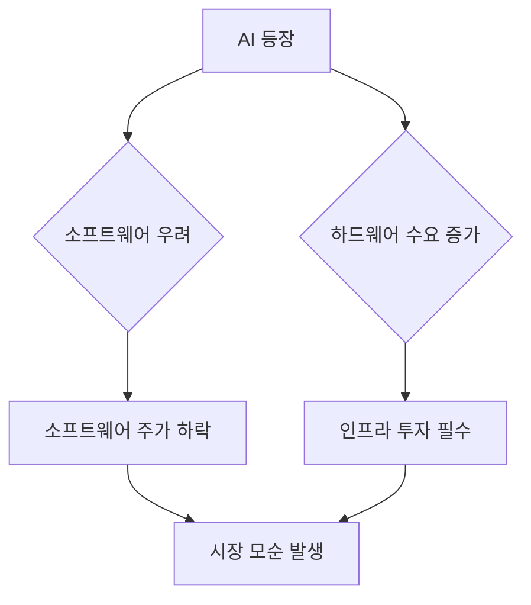

# 2026-02-04 빅테크 대기, 홍콩 약세

> 전일: [[2026-02-03 변동성 폭발, 나스닥 -1.6%]] · 기본 프레임: [[해외 지수 분석 시작하기]]

## 1) 오늘 한줄 요약
- (한국 오전 기준) **아시아는 혼조**: 상해는 거의 보합, 홍콩은 약세. 
- 미국장은 오늘도 결국 **빅테크/성장주가 방향을 만들지**가 핵심.

## 2) 지수 체크 (종가 / 전일대비)
- 🇨🇳 중국 상해종합(SHCOMP): **4,067.67** (**-0.00%**)  
- 🇭🇰 홍콩 항셍(HSI): **26,724.94** (**-0.41%**)

- 🇺🇸 NASDAQ 100 / S&P 500: *(미국장 종가 확인 후 업데이트)*

> 데이터: Stooq

## 3) 해석
- **홍콩 약세**: 전일 반등(+0.22%) 이후 바로 힘이 빠진 건 “추세 전환”보단 “단기 되돌림”에 가까운 느낌.
- **상해 보합**: 방향성은 애매하지만, 급락(-2.48%) → 반등(+1.29%) 이후에 **숨 고르기**로 볼 수도.

---

## 3.5) 오늘의 테마 메모: AI ‘모순장’

### 1) AI 등장에 따른 소프트웨어 산업 우려
- 엔트로픽/오픈AI 같은 AI가 사무 자동화, 코딩 자동화까지 들어오면서 **소프트웨어가 대체될 수 있다는 공포**가 커짐.
- 그 결과 “소프트웨어 전반”이 이유 없이 같이 맞는(투매되는) 구간이 생김.

### 2) 하드웨어 주가 동반 하락의 모순
- 예: AMD 실적 부진 같은 트리거로 **AI 하드웨어(반도체)도 같이 하락**하는데,
- 논리적으로 AI가 강해질수록 GPU/서버/전력/네트워크/메모리 수요는 늘어나는 쪽이 더 자연스러움.
- 소프트웨어 우려를 반도체에 그대로 덮어씌우는 건 앞뒤가 좀 안 맞음.

### 3) 시장의 비논리적 동시 믿음
- 시장이 동시에 믿는 두 가지:
  - (A) AI가 너무 강해서 소프트웨어가 위험하다
  - (B) AI 투자/Capex는 곧 꺾일 것이다
- JP모건 코멘트(요지): 소프트웨어는 **"무죄추정"**이 필요한 환경.
- 젠슨 황(요지): AI가 도구를 대체한다는 식의 단선적 결론은 비논리적.

### 4) 과거 사례와 현재 상황 비교
- ‘딥시크 쇼크’처럼 공포가 커져도, 결과적으로 **클라우드/인프라 Capex는 오히려 증가**했던 사례가 있음.
- 지금은 수요 부족이 아니라 **공급(전력/데이터센터/메모리) 병목** 성격이 더 강하다는 해석도 가능.

### 5) AI 인프라의 필수적 역할
- AI가 강하면 강할수록, AI를 돌리는 **물리 인프라(전력, 데이터센터, 네트워크, 메모리)**는 필수.
- 결론: AI가 사라지지 않는 한, 인프라 투자는 구조적으로 남아있을 가능성이 큼.

## 4) 오늘의 관찰 포인트
- (1) 주도주 집중도: “몇 개가 끌고 가는가?”
- (2) 금리 민감도: 금리 오를 때 성장주가 버티는가?
- (3) 중화권: 반등이 ‘정책 기대’인지 ‘수급/숏커버’인지

## 5) 내일 체크포인트
1) 빅테크 실적/가이던스 관련 후속 헤드라인
2) 달러/위안 흐름
3) 테마 유지(AI 지속) vs 로테이션 신호

## 6) 연결 노트
- 이전: [[2026-02-03 변동성 폭발, 나스닥 -1.6%]]
- 원칙/도구: [[지수 투자 시작하기]] / [[AI 투자 분석 활용하기]]
