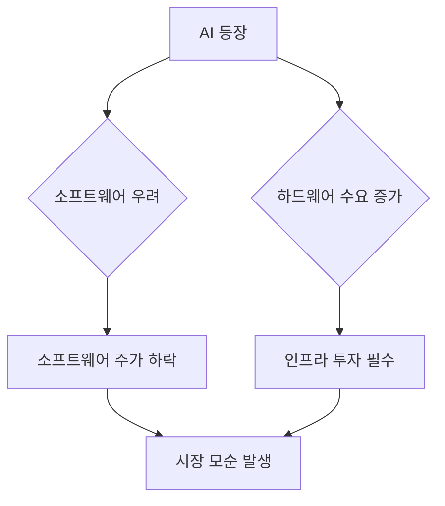

# 2026-02-04 시장 리포트

## 📌 한줄 요약
> 미국은 혼조, 아시아는 정책/수급 이슈에 따라 따로 노는 흐름.

---

## 📈 주요 지수

| 지수 | 종가 | 등락률 |
|------|------|--------|
| 🇺🇸 NASDAQ 100 | 조회 실패 | 조회 실패 |
| 🇺🇸 S&P 500 | 조회 실패 | 조회 실패 |
| 🇭🇰 항셍지수 | 조회 실패 | 조회 실패 |
| 🇨🇳 CSI 300 | 조회 실패 | 조회 실패 |

---

## 🚀 상승 Top 10

| 순위 | 종목 | 등락률 | 시장 |
|------|------|--------|------|
| - | - | - | - |

---

## 📉 하락 Top 10

| 순위 | 종목 | 등락률 | 시장 |
|------|------|--------|------|
| - | - | - | - |

---

## 🗺️ 히트맵

---

## 📰 오늘의 뉴스

### 미국
- (뉴스 수집 미설정)

### 아시아
- (뉴스 수집 미설정)

---

## ✍️ 인사이트

### 오늘 시장을 한 단어로? **모순**
- “AI가 강해서 소프트웨어는 위험하다”와 “AI 투자는 곧 꺾인다”가 같은 날 같이 가격에 반영되는 느낌.

### 1) AI 등장에 따른 소프트웨어 산업 우려
- 사무 자동화/코딩 자동화가 본격화될수록, 기존 소프트웨어의 가격 결정력이 약해질 수 있다는 공포가 커짐.
- 그래서 소프트웨어는 ‘실적과 무관하게’ 디레이팅(멀티플 하락) 당하는 구간이 생김.

### 2) 하드웨어 주가 동반 하락의 모순
- 그런데 소프트웨어 우려로 시장이 흔들릴 때, AMD 같은 실적/가이던스 이슈를 핑계로 AI 하드웨어도 같이 맞는 경우가 있음.
- 논리적으로는 AI가 강해질수록 GPU/서버/네트워크/전력/메모리 수요는 늘어나는 쪽이 자연스러운데, 가격은 반대로 가는 ‘모순장’이 나옴.

### 3) 시장의 비논리적 동시 믿음
- 시장은 동시에 믿는 듯함:
  - (A) AI는 너무 강해서 소프트웨어가 위험
  - (B) AI 투자는 꺾일 것
- 둘 중 하나만 강하게 믿어도 시장 구조가 바뀌는데, 둘을 동시에 믿으면 가격이 꼬이기 쉬움.

### 4) 과거 사례와 현재 상황 비교
- 과거 공포(딥시크 쇼크류)가 커져도, 클라우드/AI Capex는 결과적으로 증가했던 사례가 있었음.
- 현재도 수요 부족보다 **공급/물리 병목(전력, 데이터센터, 메모리)**이 더 큰 제약이라는 해석이 가능.

### 5) AI 인프라의 필수적 역할
- AI가 강하면 강할수록, AI 구동 인프라 투자는 필수.
- 그래서 하드웨어가 같이 눌리는 구간은 “AI가 꺾여서”라기보단, **포지셔닝/심리/밸류에이션 리셋**의 성격일 가능성이 큼.

### 내일 주목 포인트
1. (지수/종목) 기술주 반등 시 “추세 회복”인지 “숏커버”인지
2. 금리/달러 방향: 성장주 밸류에이션 압박 재발 여부
3. AI 인프라(전력/데이터센터) 관련 뉴스: 병목 완화 시그널

---

## 🔗 연결 노트
- 투자 원칙: [[지수 투자 시작하기]]
- 분석 도구: [[AI 투자 분석 활용하기]]
