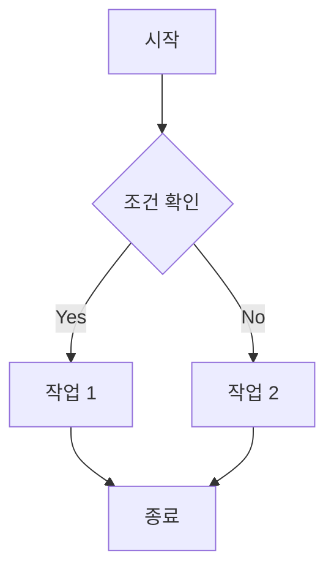

---
---

Move your body every day. Benefits include:

- Improved sleep quality
- Less risk of chronic disease
- Increased productivity
- Reduced anxiety

The "every day" part is important, because [[consistency]] is key to most things worth doing.

